# wechat-setting

> 微信公众号小程序开发设置

### 微信公众号开发设置

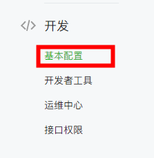

1. 开发->基本配置->公众号开发信息->**开发者密码** 启用

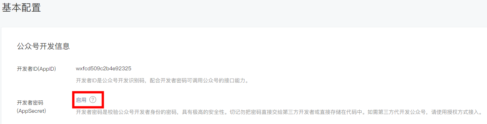

2. 管理员微信扫码验证

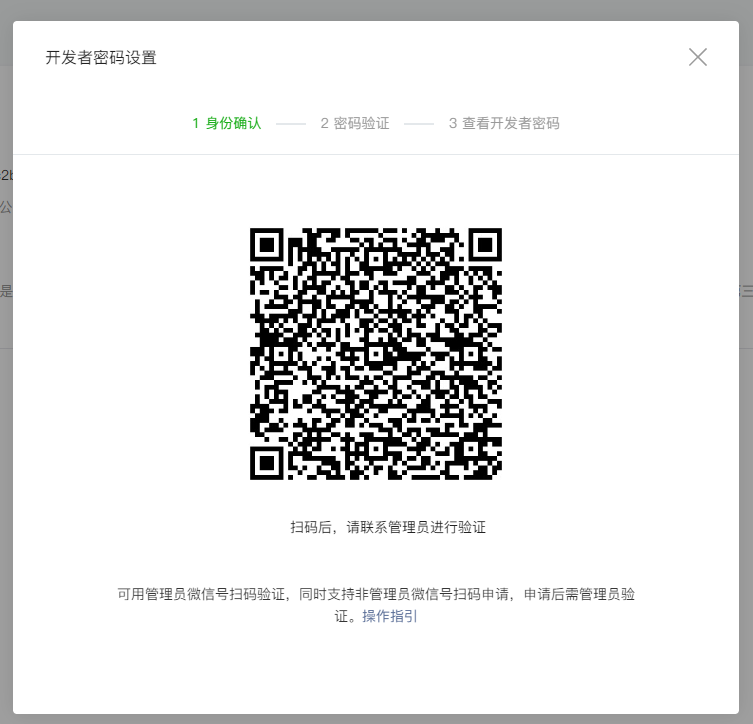

3. 密码验证

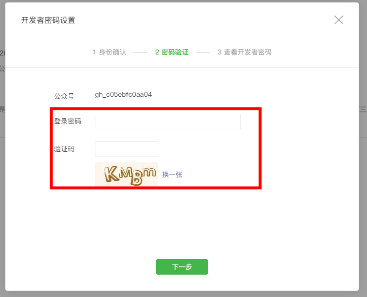

4. 查看开发者密码

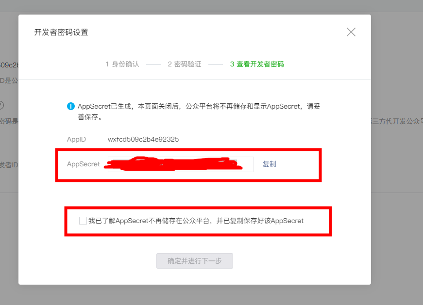

- AppID: xxxxXXXXXX
- AppSecret: XXXXXXXXXXXXXXXXXXXXX

5. 设置IP白名单

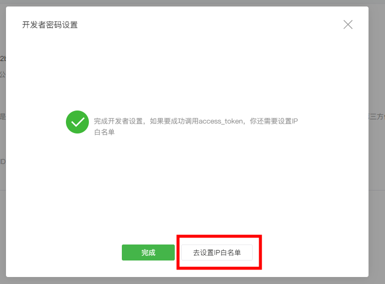

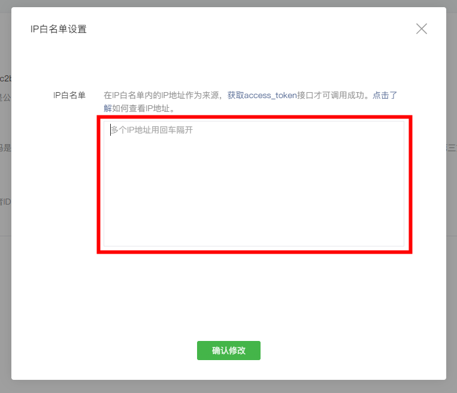

输入微信公众号网站服务器IP地址： 输入`ping www.wovert.com` 的得到网站www.wovert.com 网站的IP地址

[access_token帮助](https://mp.weixin.qq.com/wiki?t=resource/res_main&id=mp1421140183)

6. 扫码确认IP白名单设置

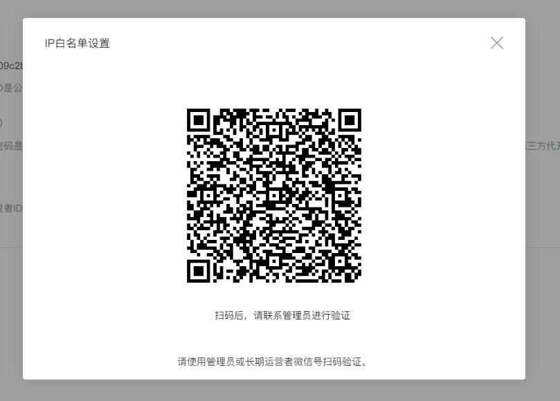

7. 查看IP白名单

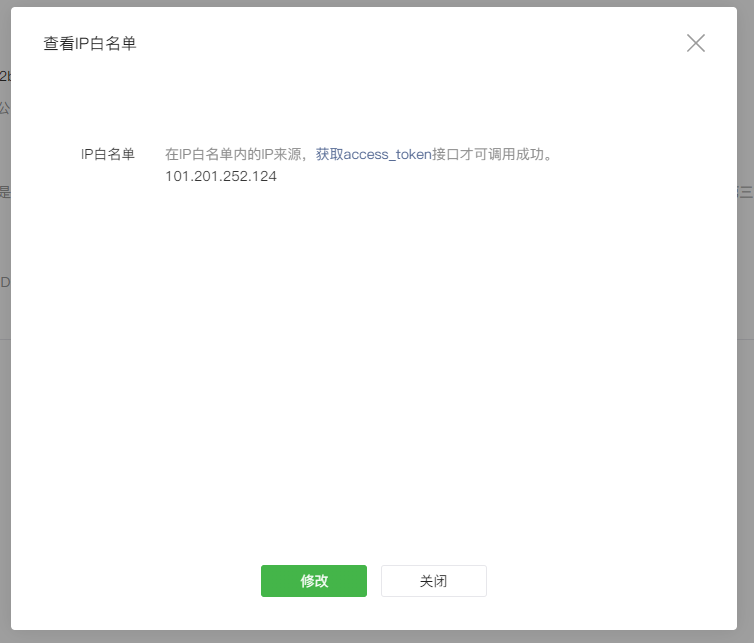

8. 设置->公众号设置->功能设置

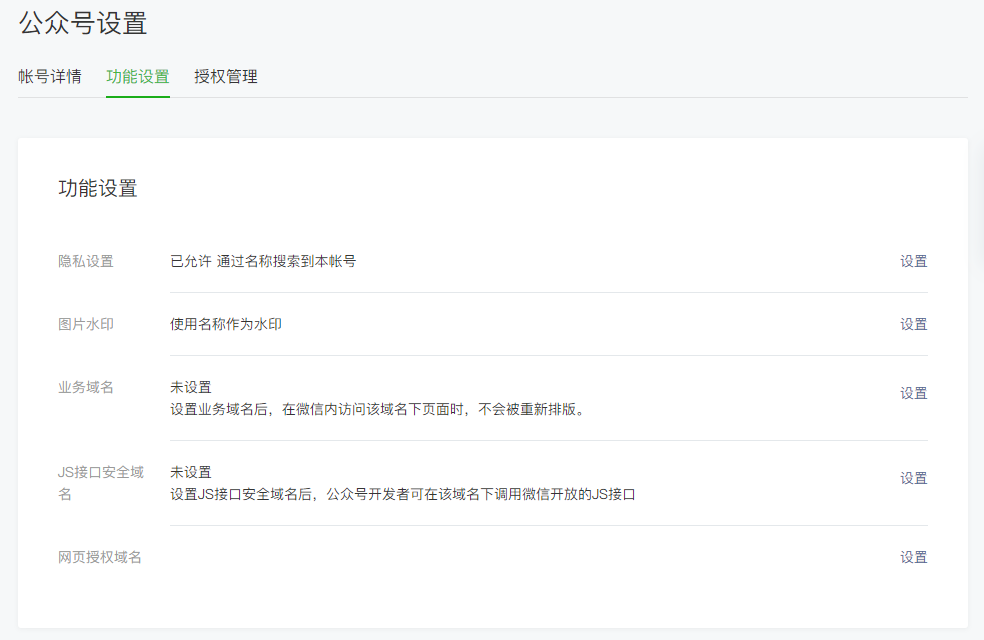

9. 业务域名

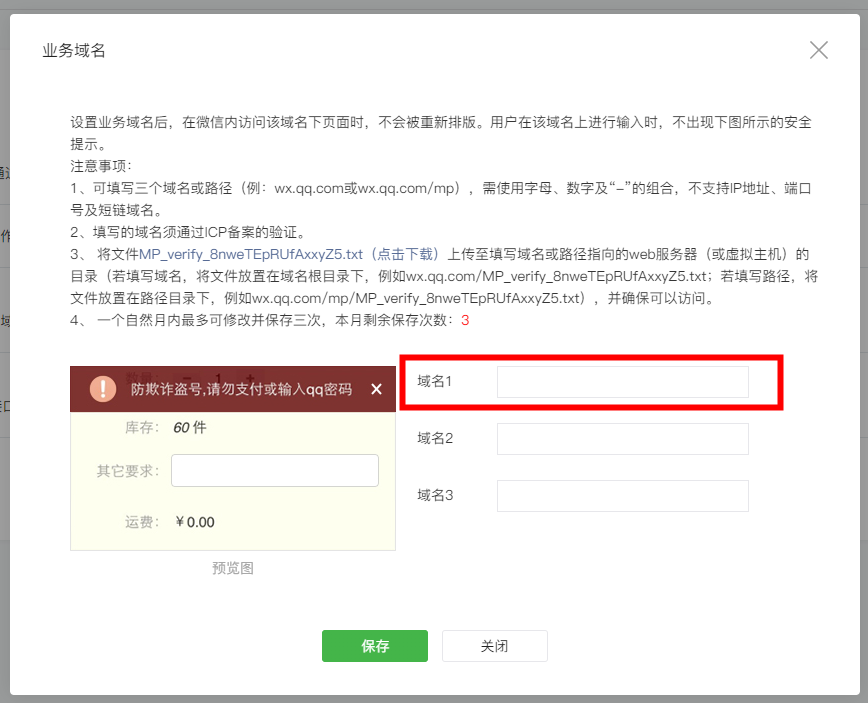

根据提示下载MP-XXXXX 文件放到输入网站地址的根目录下

10. JS接口安全域名

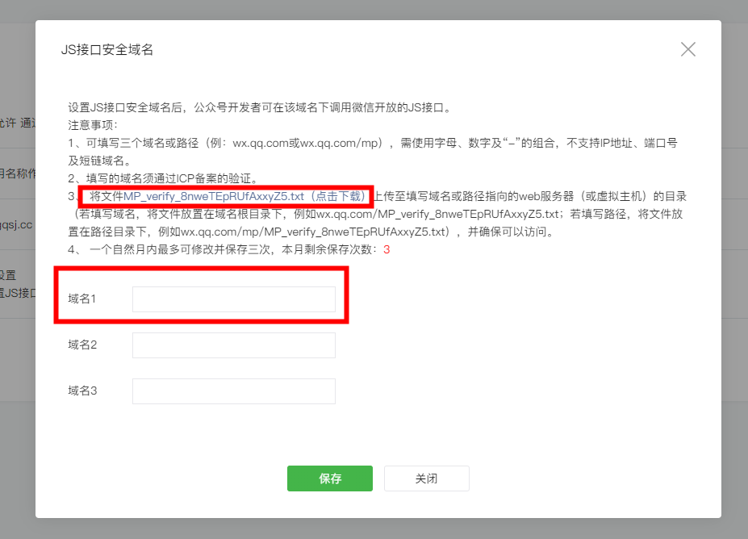

11. 网页授权域名

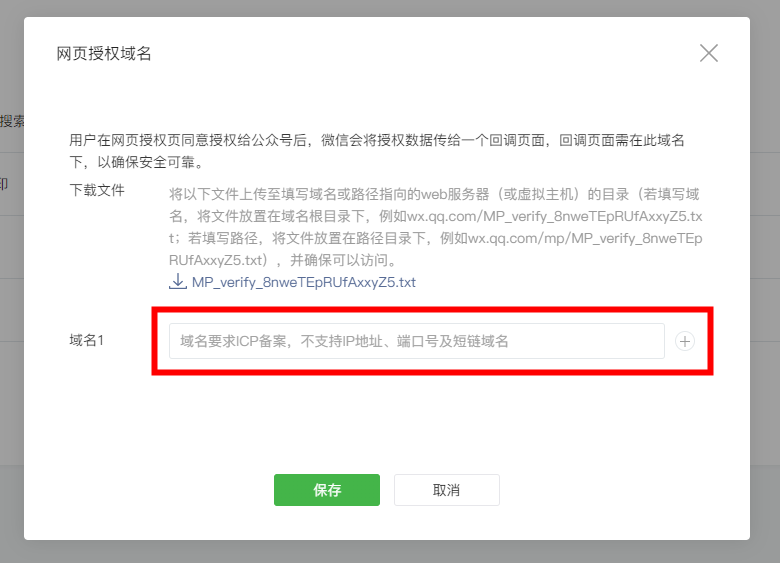

12. 关联小程序：小程序->开通->关联小程序

13. 绑定开发者：开发-> 开发者工具->web开发者工具->绑定开发者微信号

